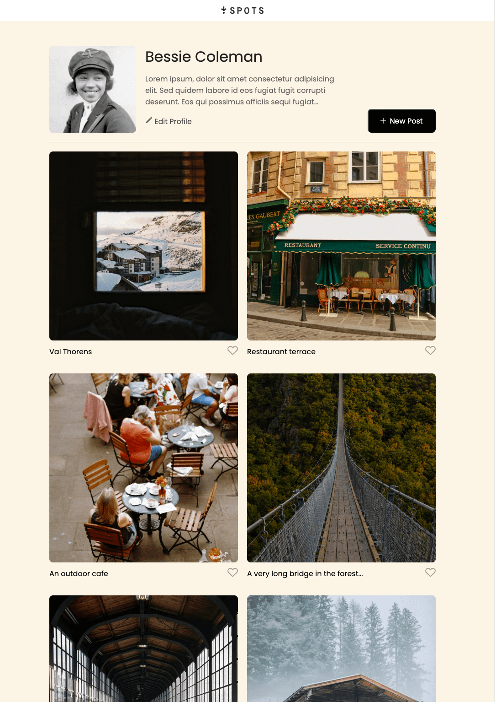
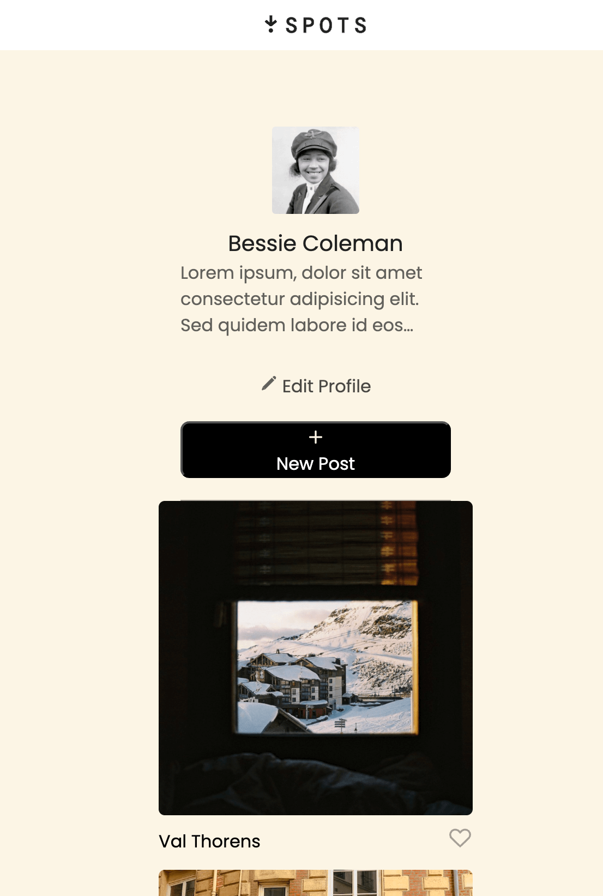

# Project 3: Spots

### Overview

Sick Spots Gallery is a responsive website where users can share and discover unique places they’ve visited. It’s designed to be visually engaging and easy to use on any device, with a layout that adapts smoothly from 320px to 1440px screen widths.

https://britneymoncada.github.io/se_project_spots/

**Intro**

Sick Spots Gallery allows travelers and explorers to showcase their favorite destinations by uploading a single photo for each location and adding a description. Each submission can contain:

Name of the contributor

Description of the spot

One photo with a caption of the location

Visitors can like photos they enjoy, helping highlight the most recommended places.

Before building the site, the layout and visual style were planned using Figma, allowing for a clear design blueprint before development began. This made it easier to ensure the site’s look, feel, and responsive behavior worked consistently across different devices.

**Images**

**Technologies Used**:

HTML5 – Structure and content

CSS3 – Styling and responsiveness

Figma – Wireframing and layout design
